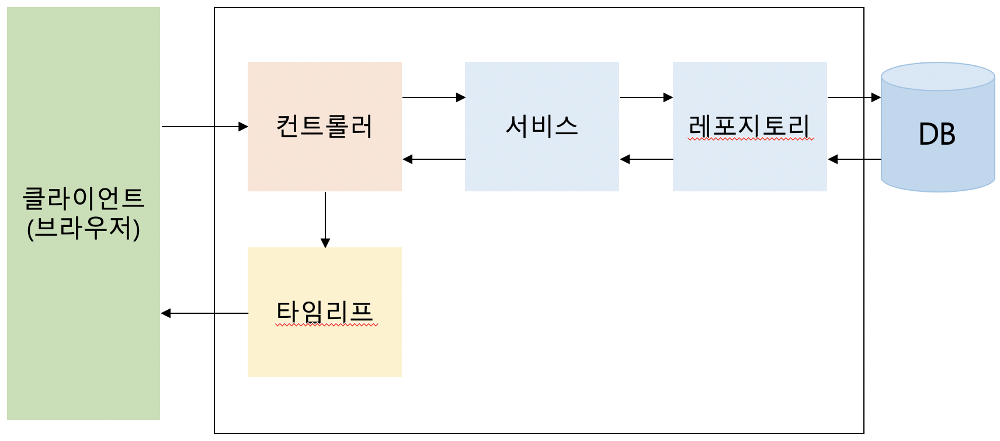

# SpringBoot 공부

#### References

- [Controller 설명 블로그](https://hardlearner.tistory.com/315)
- [@Autowired, @Service, @Reposiitory 구조](https://m.blog.naver.com/scw0531/220988401816)
- [DAO와 Repository 논쟁](http://aeternum.egloos.com/1160846)
- [Spring Bean의 개념과 Scope 종류](https://gmlwjd9405.github.io/2018/11/10/spring-beans.html)
- [Spring Boot 기반 Spring Security 회원가입/로그인 구현하기](https://xmfpes.github.io/spring/spring-security/)

## 용어

### Spring Bean

Spring에서 POJO[^1]를 'Bean' 이라고 한다. Bean은 애플리케이션의 핵심을 이루는 객체이며, Spring IoC 컨테이너에 의해 인스턴스화, 관리, 생성된다.

Spring Bean은 일반적으로 XML 파일에 정의된다.

**주요 속성**

- class(필): 정규화된 자바 클래스 이름
- id: bean의 고유 식별자
- scope: 객체의 범위
- constructor-arg: 생성 시 생성자에 전달한 인자
- property: 생성 시 bean setter에 전달한 인자
- init method
- destroy method


**Scope**

- 스프링은 기본적으로 모든 bean을 Singleton으로 생성하여 관리한다.
- request, session, global session의 scope는 일반 Spring 애플리케이션이 아닌 Spring MVC Web Application에서만 사용된다.


## 게시판 웹 서버 만들기

### Diagram




### 컨트롤러

사용자의 요청이 진입하는 지점이며, 요청에 따라 어떤 처리를 할지 결정해준다. 단, Controller는 단지 결정만 해주고 실질적인 처리는 Service에서 담당한다. 그리고 Service에서 처리한 결과를 받아 사용자에게 View를 응답으로 보내준다. (타임리프를 통해)


#### 컨트롤러를 사용하는 이유

대규모 서비스로 갈 수록 처리해야 할 서비스들이 많아지는데, 이를 하나의 클래스에 몰아서 처리하는 것이 아니라, Controller라는 중간 제어자 역할을 하는 것을 만들어서 하나의 요청에 대한 처리를 하나의 Controller가 맡아 필요한 로직 처리를 위한 서비스를 호출하게 된다.


### 서비스

비즈니스 로직을 처리하는 구현부이다. 컨트롤러가 요청받은 업무를 서비스가 담당한다.


### 레포지토리

하나의 도메인 레이어에 객체지향적인 컬렉션 관리 인터페이스를 제공하는 객체이다. 변경에 대한 불변식을 유지하기 위해 하나의 단위로 취급되면서 변경의 빈도가 비슷하고, 동시 접근에 대한 잠금의 단위가 되는 객체의 집합인 Aggregate 별로 하나의 Repository를 사용한다. 

Repository는 특정 객체 집합의 가상의 메모리 컬렉션을 관리한다. 

Repository는 문제 도메인 분석 과정에서 도메인 레이어에 속하는 객체들에게 객체 지향적인 컬렉션 인터페이스를 제공하기 위한 용도로 도메인 모델에 추가한다.

Repository는 메모리에 로드된 객체 컬렉션에 대한 집합 처리를 위한 인터페이스를 제공한다.


### DAO

DAO의 인터페이스는 데이터베이스의 CRUD 쿼리와 1:1 매칭되는 세밀한 단위의 오퍼레이션을 제공한다. 데이터베이스에 직접 접근하여 Table 연산을 수행하는 객체이다.


## Spring Boot Security


### Dependency 설정

Spring security를 사용하기 위해 build.gradle에 dependency를 추가한다.

* build.gradle

  ```groovy
  dependencies {
      // for Security
      compile 'org.springframework.boot:spring-boot-starter-security'
      compile 'org.thymleaf.extras:thymleaf-extras-springsecurity4'
      ...
  }
  ```


### SecurityConfig

스프링에서 제공하는 시큐리티 기능을 사용하려면 구성 클래스를 커스터마이징 해야 한다. Config 클래스는 WebSecurityConfigurerAdapter를 상속하는 클래스로 정의한다.

```Java
@EnableWebSecurity
public class SecurityConfig extends WebSecurityConfigurerAdapter {
	...
}
```

위와 같이 아무런 설정을 하지 않으면 사이트 전체가 잠겨서 비밀번호를 쳐야 접근을 할 수 있다. 모든 사용자가 사용할 수 있게끔 url을 일부 열어두도록 하자.

```java
@EnableWebSecurity
public class SecurityConfig extends WebSecurityConfigurerAdapter {
	
	@Override
	public void configure(WebSecurity web) throws Exception
	{
		web.ignoring().antMatchers("/css/**", "/script/**", "/images/**", "/fonts/**", "lib/**", "/js/**");
	}
	@Override
	protected void configure(HttpSecurity http) throws Exception
	{
		http.authorizeRequests()
			.antMatchers("/admin/**").hasRole("ADMIN")
      .antMatchers("/board/**").authenticated()
			.antMatchers("/**").permitAll()
	}
}
```

* 첫 번째 configure에서는 url 자원이 아닌 리소스는 모든 사용자가 접근할 수 있게끔 설정한다.
* 두 번째 configure에서 사용자의 role에 따라 url접근을 제한한다.
  * antMacthers는 접근 리소스를 의미한다.
  * hasRole()은 해당 자원에 접근할 수 있는 역할을 제한한다.
  * permitAll()은 모든 사용자가 접근할 수 있다는 의미이다.


### Domain 설정

사용자의 정보를 담는 도메인을 설정한다. User 클래스는 추후에 스프링 시큐리티에서 사용되는 클래스이기 때문에 User가 아닌 이름 (예를 들어, Member)으로 클래스를 설계해야 한다.

```java
@Getter
@Setter
@NoArgsConstructor
@Entity
@Table
public class Member {

    @Id
    @Column
    @GeneratedValue(strategy = GenerationType.IDENTITY)
    private Long idx;

    @Column
    private String name;

    @Column
    private String password;

    @Column
    private String email;

    @Column
    private LocalDateTime createdDate;

    @Column
    private LocalDateTime updatedDate;

    @OneToMany(cascade = CascadeType.ALL, fetch = FetchType.EAGER)
    @JoinColumn(name="idx")
    private List<MemberRole> roles;

    @Builder
    public Member(String name, String password, String email, LocalDateTime createdDate, LocalDateTime updatedDate) {
        this.name = name;
        this.password = password;
        this.email = email;
        this.createdDate = createdDate;
        this.updatedDate = updatedDate;
    }
}
```

 그리고 스프링 시큐리티에서는 Role에 따라 접근할 수 있는 url이 다르기 때문에 MemberRole 클래스도 만들어주자.

```java
@Getter
@Setter
@Entity
@EqualsAndHashCode(of = "rno")
@ToString
public class MemberRole {
    @Id
    @Column
    @GeneratedValue(strategy = GenerationType.IDENTITY)
    private Long idx;

    @Column
    @Enumerated(EnumType.STRING)
    private RoleType roleType;

}
```


### 회원가입 로직

회원가입 요청은 먼저 Controller에서 받는다.

**MemberController**

```java
@Controller
@RequestMapping("/member")
public class MemberController {

    @Autowired
    private MemberService memberService;

    @GetMapping("join")
    public String join() {
        return "member/join";
    }

    @PostMapping("create")
    public String create(@RequestParam("uname") String name, @RequestParam("uemail") String email,
                         @RequestParam("upw") String password, @RequestParam("upw_check") String pwCheck) {

        Member member = Member.builder()
                .name(name)
                .email(email)
                .password(password)
                .build();

        memberService.signup(member);
        return "redirect:/board/list";
    }
}
```

* join()은 입력 폼을 사용자에게 전달한다.
* create()는 입력 폼에서 받은 입력값을 전달받아 MemberService 객체를 통해 회원정보를 데이터베이스에 올린다. 


**MemberService**

```java
@Service
public class MemberService {

    @Autowired
    private MemberRepository memberRepository;

    private BCryptPasswordEncoder passwordEncoder = new BCryptPasswordEncoder();

    public void signup(Member member) {
        MemberRole role = new MemberRole();
        member.setPassword(passwordEncoder.encode(member.getPassword()));
        role.setRoleType(RoleType.user);
        memberRepository.save(member);
    }
}
```

* signup()은 전달받은 Member 정보를 데이터베이스에 올리는데, password를 암호화하여 올린다. 암호화 방법은 BcryptPasswordEncoder이다.


### 로그인

스프링 시큐리티에서 로그인 처리를 구현하려면 SecurityConfig에서 AuthenticationManagerBuilder를 주입해서 인증에 대한 처리를 해야 한다.

```java
@EnableWebSecurity
public class SecurityConfig extends WebSecurityConfigurerAdapter {
  ...

	@Autowired
  private CustomUserDetailsService customUserDetailsService;
	
  @Bean
  public PasswordEncoder passwordEncoder() {
      return new BCryptPasswordEncoder();
  }

  @Autowired
  public void configureGlobal(AuthenticationManagerBuilder auth) throws Exception {
    auth.userDetailsService(customUserDetailsService).passwordEncoder(passwordEncoder());
  }
  ...
    
}
```

* 로그인 처리를 하기 위해서는 데이터베이스를 바탕으로 인증을 처리하는 로직이 필요하다. 이러한 로직은 UserDetailsService 인터페이스를 구현해야 한다. 그리고 이를 HttpSecurity 객체가 사용하도록 지정하면 우리가 만든 인증 로직을 바탕으로 동작한다.


```java
@Service
public class CustomUserDetailsService implements UserDetailsService  {

    @Autowired
    MemberRepository memberRepository;

    @Override
    public UserDetails loadUserByUsername(String email) throws UsernameNotFoundException, NoSuchElementException {
        System.out.println(email);
        return Optional.ofNullable(memberRepository.findByEmail(email))
                .filter(m -> m != null)
                .map(m -> new SecurityMember(m)).get();
    }
}
```

* CustomUserDtailsService를 구현하면서 MemberRepository와 연동해 데이터베이스에 저장된 회원정보를 바탕으로 인증을 구현해야 하는데, 스프링 시큐리티의 User 클래스와 우리의 Member 클래스와 타입이 일치하지 않는 문제가 생긴다. 따라서 인증을 위한 User 상속 클래스를 만들어야 한다.


```java
public class SecurityMember extends User {
    private static final String ROLE_PREFIX = "ROLE_";
    private static final long serialVersionUID = 1L;

    public SecurityMember(Member member) {
        super(member.getEmail(), member.getPassword(), makeGrantedAuthority(member.getRoles()));
    }

    private static List<GrantedAuthority> makeGrantedAuthority(List<MemberRole> roles){
        List<GrantedAuthority> list = new ArrayList<>();
        roles.forEach(role -> list.add(new SimpleGrantedAuthority(ROLE_PREFIX + role.getRoleType())));
        return list;
    }
}
```

* Member 정보를 받아 SpringSecurity의 User 타입과 우리가 구현한 Member의 값들을 매칭시켜줘서 사용하면 된다.
* 이런식으로 타입을 맞추면 CustomUserDetailsService가 잘 돌아간다.


#### 로그인 url 등록하기

Config파일에 다음을 추가하자.

```java
@Override
protected void configure(HttpSecurity http) throws Exception
{
	http.authorizeRequests()
		.antMatchers("/admin/**").hasRole("ADMIN")
		.antMatchers("/**").permitAll()
		.and().formLogin()
		.loginPage("/member/login")
		.loginProcessingUrl("/member/login")
		.defaultSuccessUrl("/")
    	.failureUrl("/member/login")
    	.and()
    	.logout();
}
```


### 로그인 성공 시 부가적인 작업 추가하기

로그인 성공 시 리다이렉트되기 전의 페이지로 이동하거나 하는 부가작업을 추가하기 위해서는 SecurityConfig의 successHandler에 핸들러를 등록해주어야 한다. 등록할 핸들러는 AuthenticationSuccessHandler 타입이기 때문에, AuthenticationSuccessHandler를 구현하면서 로그인 성공시 사용되는 핸들러인 SaveRequestAwareAuthenticationSuccessHandler를 상속받아 구현하고 SecurityConfig에 등록시켜주면 된다.

```java
public class CustomLoginSuccessHandler extends SavedRequestAwareAuthenticationSuccessHandler {
    public CustomLoginSuccessHandler(String defaultTargetUrl) {
        setDefaultTargetUrl(defaultTargetUrl);
    }
    @Override
    public void onAuthenticationSuccess(HttpServletRequest request, HttpServletResponse response,
                                        Authentication authentication) throws ServletException {
        HttpSession session = request.getSession();

        try {
            if (session != null) {
                String redirectUrl = (String) session.getAttribute("prevPage");
                if (redirectUrl != null) {
                    session.removeAttribute("prevPage");
                    getRedirectStrategy().sendRedirect(request, response, redirectUrl);
                } else {
                    super.onAuthenticationSuccess(request, response, authentication);
                }
            } else {
                super.onAuthenticationSuccess(request, response, authentication);
            }
        } catch (IOException ie) {
            ie.printStackTrace();
        }
    }
}
```


#### 각주

[^1]: Plain, old java object라는 의미로, 오래된 방식의 간단한 자바 오브젝트라는 말.